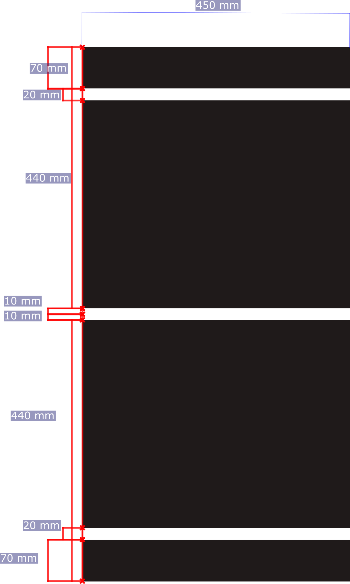
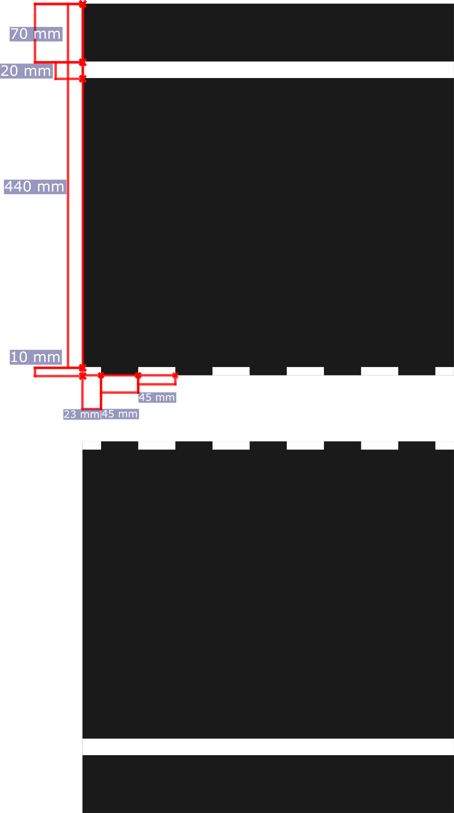
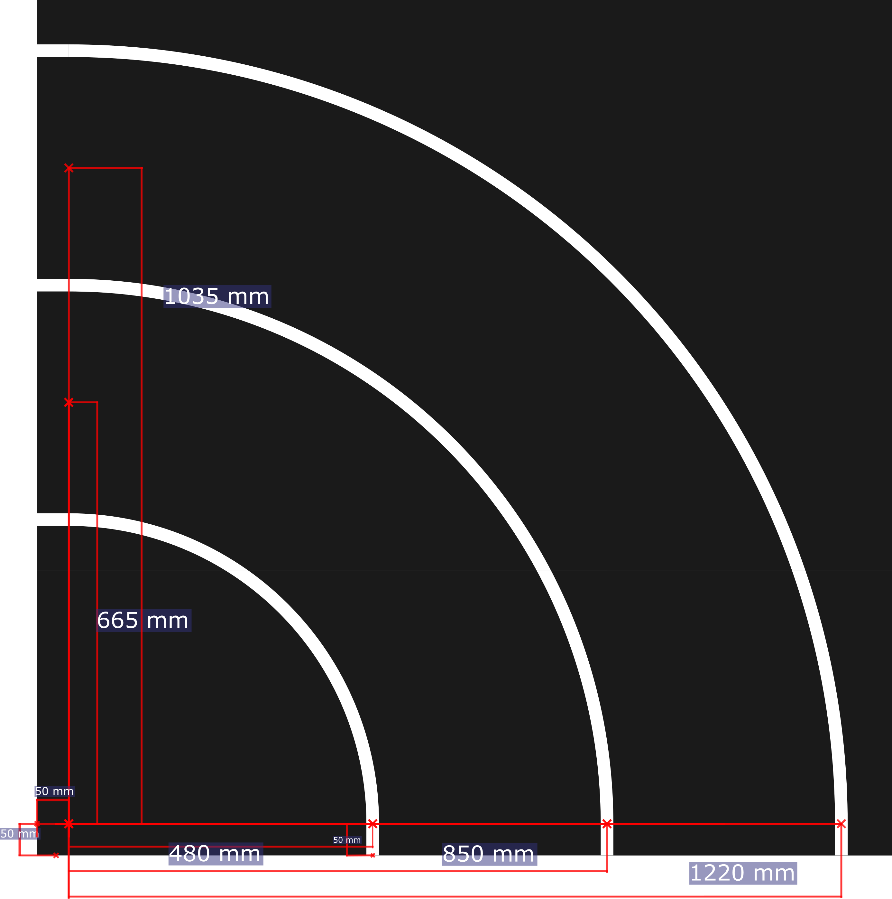
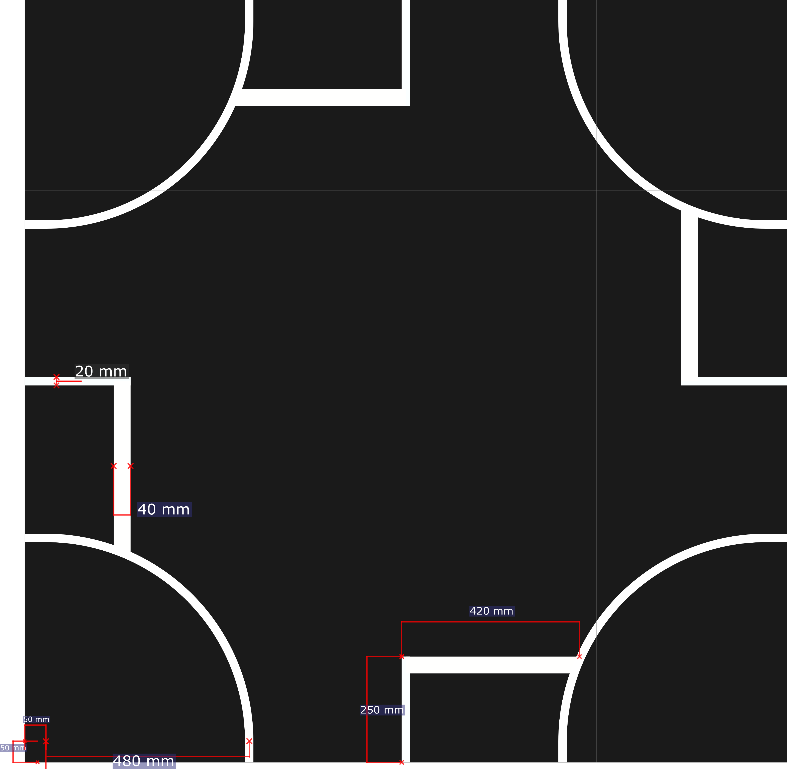
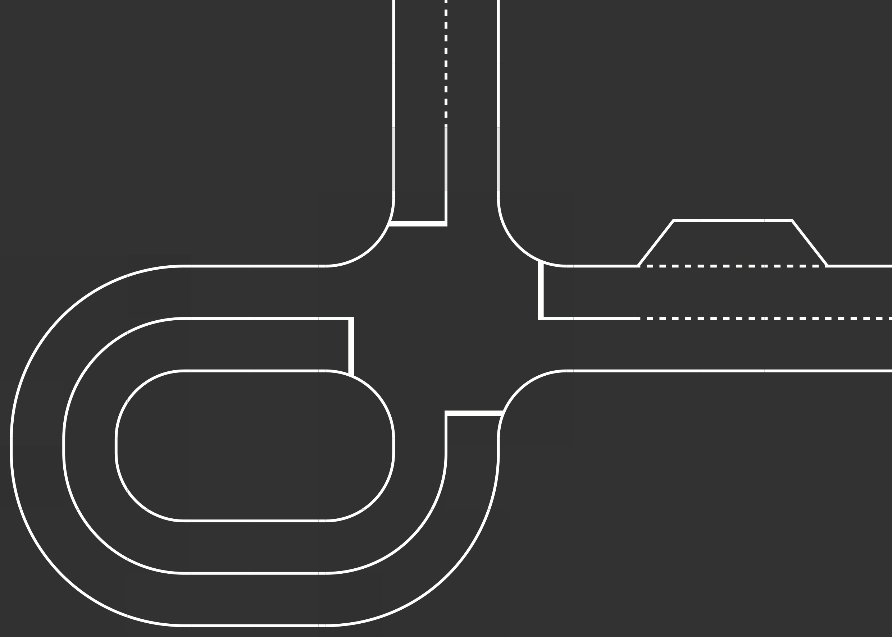

# Track templates
The track templates are dawn  in the Track_template.svg, the file's location is the images/Track folder. The .svg file can be opened with the Inkscape. All track components are built from squares, which size is 0.45x0.45 meter.

## Straight Road

----

## Road curve

## Intersections

---

## Example track

